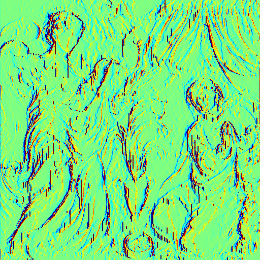
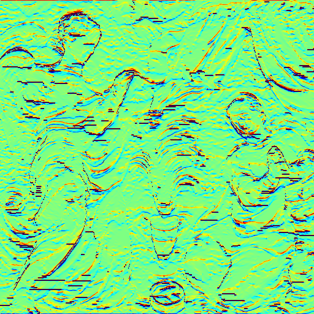

# BiNI Test: Fig8_wallrelief

## Input Files

**Normal Map:**


**Mask:**


---

## Command to Run

```bash
python bilateral_normal_integration_numpy.py --path data/Fig8_wallrelief/
```

## Output Files

**u-direction:**



**v-direction:**

