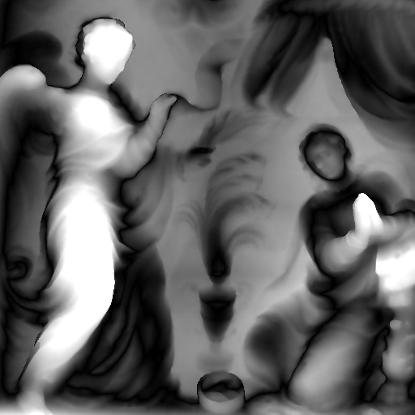
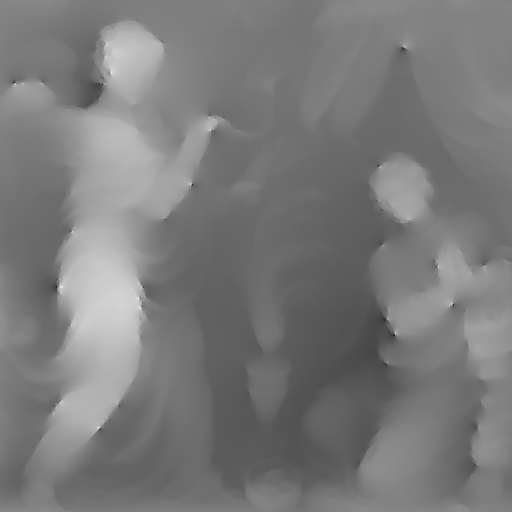

# BiNI Test: Fig8 Wall Relief

This document summarizes the test results for **Bilateral Normal Integration (BiNI)** applied to the **Fig8 Wall Relief** dataset.

---

## 1. Input Files

**Normal Map**  


**Mask (White image)**  


---

## 2. Command to Run Integration

```bash
python bilateral_normal_integration_numpy.py --path data/Fig8_wallrelief/
```

---

## 3. Output from Integration

**u-direction Weights**  


**v-direction Weights**  


**Integrated Depth Map (Pixel Units, Normalized Grayscale)**  
Generated by running bilateral normal integration on the input normal map, saving the raw depth (`z_pix.npy`), and normalizing values to 0–255 for visualization.  
Produced after changes in [commit 8e735c6](https://github.com/MrzAhmadi/bilateral_normal_integration_testing/commit/8e735c67aeba2b0bc1a9c0b0050d3c3c1de33968).


---

## 4. Depth Evaluation (Ground Truth Normals)

**Unit Conversions**
- **GT (16-bit) → mm:**  
  `mm_per_gt_unit = 5000 / 65535 = 0.0762951095 mm/unit`
- **Integrated depth (pixels) → mm:**  
  `mm_per_pixel = 4000 / 512 = 7.8125 mm/pixel`

**Alignment Details**
- Sign flipped: **Yes (via affine scale a = -0.035702)**
- Applied zero offset: **4825.830566 mm** (~4.83 m)

**Metrics (GT Normals)**
| Metric | Value (mm) | Value (px) |
|---|---:|---:|
| MAE | **71.553513** | **9.158850** |
| RMSE | **88.578079** | **11.337994** |

**Visual Results**
| Ground Truth | Aligned Estimate | Absolute Error (mm) |
|--------------|------------------|---------------------|
|  |  |  |

---

## 5. Photometric Stereo Evaluation

We also tested the pipeline using **normals estimated via Photometric Stereo (PS)** instead of ground-truth normals.  
The script [`photometric_stereo.py`](photometric_stereo.py) (located in the root of the repository) was added for this purpose.

**Integrated Depth Map**  


### Commands

```bash
python photometric_stereo.py   --images_dir data/Fig8_wallrelief/material_4   --lights data/Fig8_wallrelief/lights.txt   --mask data/Fig8_wallrelief/mask.png   --shadows_dir data/Fig8_wallrelief/shadows   --out_dir data/Fig8_wallrelief_ps   --copy_from data/Fig8_wallrelief

python bilateral_normal_integration_numpy.py --path data/Fig8_wallrelief_ps

python evaluate_depth_error.py --path data/Fig8_wallrelief_ps
```

### Metrics (PS Normals)
| Metric | Value (mm) | Value (px) |
|---|---:|---:|
| MAE | **65.444206** | **8.376858** |
| RMSE | **80.670036** | **10.325765** |

### Visual Results (PS Normals)
| Ground Truth | Aligned Estimate | Absolute Error (mm) |
|--------------|------------------|---------------------|
|  |  |  |

---

## 6. Compare Normals

We use `compare_normals.py` to measure angular errors between **ground-truth normals** and **PS-estimated normals**.

### Command
```bash
python compare_normals.py
```

### Output
```
[OK] Saved to data/Fig8_wallrelief_ps/normals_compare
Mean angular error: 38.04 deg | Median: 37.84 deg | (global flip applied)
```

### Explanation
- Computes **per-pixel angular error** between GT normals and PS normals.
- Applies a **global flip correction** if average error is lower after flipping all normals.
- Produces visualization in `data/Fig8_wallrelief_ps/normals_compare/`:
  - `gt_normal_rgb.png`: Ground-truth normals (RGB encoded).
  - `ps_normal_rgb.png`: PS-estimated normals.
  - `angular_error_deg.png`: Heatmap of angular error (degrees).

---

## 7. Check lights normalization
```bash
python3 -c "import numpy as np; L=np.loadtxt('lights.txt'); norms=np.linalg.norm(L, axis=1); print('Mean norm:', np.mean(norms), 'Should be close to 1')"
Mean norm: 0.999981787491417 Should be close to 1
```

## 8. Reproducibility

```bash
# Run integration to generate z_pix.npy
python bilateral_normal_integration_numpy.py --path data/Fig8_wallrelief

# Evaluate depth against ground truth
python evaluate_depth_error.py --path data/Fig8_wallrelief

# Photometric Stereo case
python photometric_stereo.py   --images_dir data/Fig8_wallrelief/material_4   --lights data/Fig8_wallrelief/lights.txt   --mask data/Fig8_wallrelief/mask.png   --shadows_dir data/Fig8_wallrelief/shadows   --out_dir data/Fig8_wallrelief_ps   --copy_from data/Fig8_wallrelief

python bilateral_normal_integration_numpy.py --path data/Fig8_wallrelief_ps
python evaluate_depth_error.py --path data/Fig8_wallrelief_ps

# Compare normals (GT vs PS)
python compare_normals.py
```