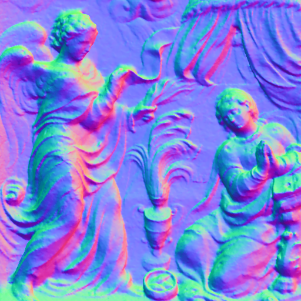
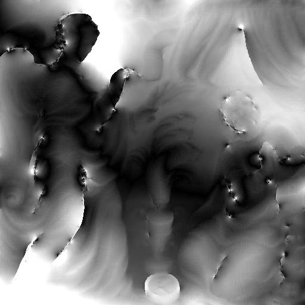

# BiNI Test: Fig8 Wall Relief

This document summarizes the test results for **Bilateral Normal Integration (BiNI)** applied to the **Fig8 Wall Relief** dataset.

---

## 1. Input Files

**Normal Map**  


**Mask (White image)**  


---

## 2. Command to Run Integration

```bash
python bilateral_normal_integration_numpy.py --path data/Fig8_wallrelief/
```

---

## 3. Output from Integration

**u-direction Weights**  


**v-direction Weights**  


**Integrated Depth Map (Pixel Units, Normalized Grayscale)**  
Generated by running bilateral normal integration on the input normal map, saving the raw depth (`z_pix.npy`), and normalizing values to 0–255 for visualization.  
Produced after changes in [commit 8e735c6](https://github.com/MrzAhmadi/bilateral_normal_integration_testing/commit/8e735c67aeba2b0bc1a9c0b0050d3c3c1de33968).


---

## 4. Depth Evaluation (Ground Truth Normals)

**Unit Conversions**
- **GT (16-bit) → mm:**  
  `mm_per_gt_unit = 5000 / 65535 = 0.0762951095 mm/unit`
- **Integrated depth (pixels) → mm:**  
  `mm_per_pixel = 4000 / 512 = 7.8125 mm/pixel`

**Alignment Details**
- Sign flipped: **Yes (via affine scale a = -0.035702)**
- Applied zero offset: **4825.830566 mm** (~4.83 m)

**Metrics (GT Normals)**
| Metric | Value (mm) | Value (px) |
|---|---:|---:|
| MAE | **71.553513** | **9.158850** |
| RMSE | **88.578079** | **11.337994** |

**Visual Results**
| Ground Truth | Aligned Estimate | Absolute Error (mm) |
|--------------|------------------|---------------------|
|  |  |  |

---

# Bilateral Normal Integration Testing

## 5. Photometric Stereo Evaluation

We also tested the pipeline using **normals estimated via Photometric Stereo (PS)** instead of ground-truth normals.

The script `photometric_stereo.py` (located in the root of the repository) was used for this purpose.

---

### Estimated Normals (Photometric Stereo)


---

### Integrated Depth Map (Aligned to GT)
Evaluation was done with `evaluate_depth_error.py`.

**Metrics (PS Normals):**

| Metric | Value (mm) | Value (px) |
|--------|------------|------------|
| MAE    | 54.952358  | 7.03390   |
| RMSE   | 66.155998  | 8.467968  |

---

### Visual Results (PS Normals)

| Ground Truth | Aligned Estimate | Absolute Error (mm) |
|--------------|-----------------|----------------------|
|  |  |  |

---

## 6. Reproducibility

```bash
# --- Step 1: Run integration to generate z_pix.npy ---
python bilateral_normal_integration_numpy.py \
    --path data/Fig8_wallrelief

# --- Step 2: Evaluate depth against ground truth ---
python evaluate_depth_error.py \
    --path data/Fig8_wallrelief


# === Photometric Stereo Pipeline ===

# Step 3: Run Photometric Stereo
python photometric_stereo.py \
  --images_dir data/Fig8_wallrelief/material_4 \
  --lights     data/Fig8_wallrelief/lights.txt \
  --mask       data/Fig8_wallrelief/mask.png \
  --shadows_dir data/Fig8_wallrelief/shadows \
  --shadow_mode per_image --shadow_pct 20 \
  --out_dir    data/Fig8_wallrelief_ps \
  --copy_from  data/Fig8_wallrelief \
  --save_shadow_debug --save_fc_prior

# Step 4: Depth integration with FC prior
python run_ps_with_fc_prior.py \
  --path data/Fig8_wallrelief_ps \
  --k 3.0 --iter 300 --tol 1e-6 --lambda1 0.1945

# Step 5: Evaluate depth result
python evaluate_depth_error.py \
    --path data/Fig8_wallrelief_ps
```